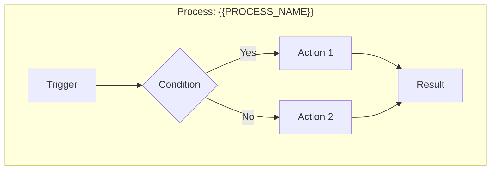
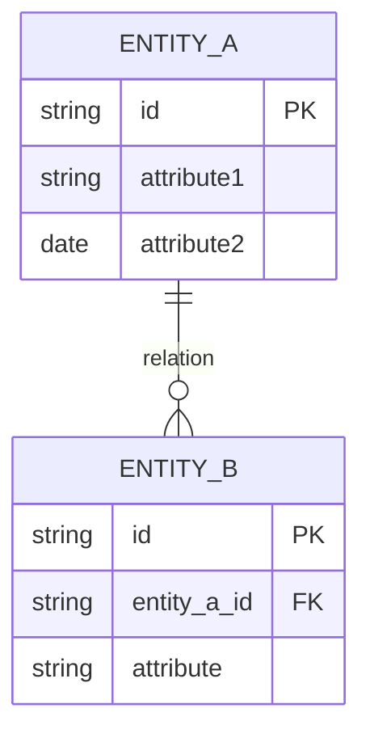

# Business Analyse - Analyse

Senior BA expert in modeling. ULTRATHINK mode mandatory.

## Arguments

```
/business-analyse:3-analyse [feature-id]
```

- `feature-id`: Feature identifier (e.g., FEAT-001)

## Prerequisites

```bash
# Verify that discovery exists
test -f ".business-analyse/applications/*/modules/*/features/$ARGUMENTS/1-discovery.md" || \
  echo "Execute /business-analyse:2-discover first"
```

## ULTRATHINK Mode

**IMPORTANT**: This phase uses the `ultrathink` skill for in-depth modeling.

```
Skill(skill="ultrathink", args="Business analysis and BRD modeling")
```

Approach to adopt:
- Model with precision
- Identify business patterns
- Validate consistency
- Anticipate evolutions

## Workflow

### Step 0: Scan existing specifications (Agent Sonnet)

**MANDATORY**: Before any analysis, scan all existing specifications to understand the global context.

```
Task(subagent_type="Explore", model="sonnet", prompt="
Scan all existing Business Analyse specifications in .business-analyse/

SEARCH FOR:
1. All existing features (FEAT-XXX)
   - Path: .business-analyse/applications/**/features/*/
   - Status of each (discovery/analysis/specified/validated)

2. Existing FRDs (3-functional-specification.md)
   - List entities already specified
   - List APIs already documented
   - List business rules already defined

3. Dependencies between features
   - Shared entities
   - Shared business rules
   - Integration points

4. Glossary terms already defined
   - Read .business-analyse/glossary.md

RETURN a structured summary:
{
  'existing_features': [
    {'id': 'FEAT-XXX', 'name': '...', 'status': '...', 'entities': [...]}
  ],
  'shared_entities': ['Entity1', 'Entity2'],
  'shared_rules': ['BR-001', 'BR-002'],
  'glossary_terms': ['term1', 'term2'],
  'potential_conflicts': ['...']
}

This context will be used to ensure consistency with existing specifications.
")
```

**Use scan results to:**
- Avoid duplicating existing entities
- Reuse existing business rules (BR-XXX)
- Identify dependencies with other features
- Ensure consistent naming conventions

---

### Step 1: Load context

```bash
cat .business-analyse/config.json
cat ".business-analyse/applications/*/modules/*/features/$FEATURE_ID/1-discovery.md"
cat .business-analyse/glossary.md
```

### Step 2: Business process modeling

Create process diagrams in **Mermaid**:



For each process identify:
- **Trigger**: What starts the process?
- **Actors**: Who intervenes?
- **Actions**: What steps?
- **Decisions**: What conditions/branches?
- **Results**: What outputs?

### Step 3: Data modeling

Create conceptual ER diagram in **Mermaid**:



For each entity document:
- **Key attributes**: Essential properties
- **Identifiers**: Primary/natural keys
- **Relations**: Cardinalities and types
- **Constraints**: Validity rules

### Step 4: Business rules catalog

Document ALL business rules:

| ID | Category | Rule | Condition | Action | Priority |
|----|----------|------|-----------|--------|----------|
| BR-001 | Validation | {{RULE}} | IF {{COND}} | THEN {{ACTION}} | HIGH |
| BR-002 | Calculation | {{RULE}} | {{FORMULA}} | {{RESULT}} | MEDIUM |
| BR-003 | Workflow | {{RULE}} | {{STATE}} | {{TRANSITION}} | HIGH |

Rule categories:
- **Validation**: Data validation rules
- **Calculation**: Business formulas and algorithms
- **Workflow**: State transitions and processes
- **Authorization**: Permission rules
- **Constraint**: Limitations and restrictions

### Step 5: Business requirements matrix

Create traceability matrix:

| ID | Requirement | Type | Priority | Source | Acceptance criteria |
|----|-------------|------|----------|--------|---------------------|
| REQ-001 | {{REQUIREMENT}} | Functional | Must | Discovery §X | {{CRITERIA}} |
| REQ-002 | {{REQUIREMENT}} | Non-functional | Should | Discovery §Y | {{CRITERIA}} |

Requirement types:
- **Functional**: What the system must do
- **Non-functional**: Performance, security, UX
- **Constraint**: Technical/legal limitations
- **Interface**: External integrations

### Step 6: Impact analysis

```
╔══════════════════════════════════════════════════════════════════════════╗
║  IMPACT ANALYSIS                                                         ║
╠══════════════════════════════════════════════════════════════════════════╣
║                                                                          ║
║  IMPACTED SYSTEMS                                                        ║
║  ────────────────                                                        ║
║  • {{SYSTEM_1}}: {{IMPACT_DESCRIPTION}}                                  ║
║  • {{SYSTEM_2}}: {{IMPACT_DESCRIPTION}}                                  ║
║                                                                          ║
║  IMPACTED DATA                                                           ║
║  ─────────────                                                           ║
║  • {{ENTITY_1}}: {{MODIFICATION_TYPE}} (CREATE/UPDATE/DELETE)            ║
║  • {{ENTITY_2}}: {{MODIFICATION_TYPE}}                                   ║
║                                                                          ║
║  IMPACTED PROCESSES                                                      ║
║  ──────────────────                                                      ║
║  • {{PROCESS_1}}: {{CHANGE_DESCRIPTION}}                                 ║
║                                                                          ║
║  IMPACTED USERS                                                          ║
║  ──────────────                                                          ║
║  • {{ROLE_1}}: {{WORKFLOW_CHANGE}}                                       ║
║                                                                          ║
║  REGRESSION RISKS                                                        ║
║  ────────────────                                                        ║
║  • {{REGRESSION_RISK}}                                                   ║
║                                                                          ║
╚══════════════════════════════════════════════════════════════════════════╝
```

### Step 7: Update glossary

Add newly identified business terms to `.business-analyse/glossary.md`.

### Step 8: Generate BRD

Create `2-business-requirements.md`:

```markdown
# Business Requirements Document - {{FEATURE_NAME}}

**ID**: {{FEAT-XXX}}
**Version**: 1.0
**Date**: {{DATE}}
**Status**: Draft
**Author**: Claude (Business Analyse)

---

## 1. Executive Summary

### 1.1 Objective
{{BUSINESS_OBJECTIVE}}

### 1.2 Expected Benefits
| Benefit | Metric | Target |
|---------|--------|--------|
| {{BENEFIT}} | {{METRIC}} | {{TARGET}} |

### 1.3 Scope
- **Included**: {{IN_SCOPE}}
- **Excluded**: {{OUT_SCOPE}}

---

## 2. Business Context

### 2.1 Current Situation (As-Is)
{{AS_IS_DESCRIPTION}}

```mermaid
flowchart LR
    subgraph "Current Process"
        {{AS_IS_PROCESS}}
    end
```

### 2.2 Target Situation (To-Be)
{{TO_BE_DESCRIPTION}}

```mermaid
flowchart LR
    subgraph "Target Process"
        {{TO_BE_PROCESS}}
    end
```

### 2.3 Gap Analysis
| Aspect | As-Is | To-Be | Gap |
|--------|-------|-------|-----|
| {{ASPECT}} | {{CURRENT}} | {{TARGET}} | {{GAP}} |

---

## 3. Stakeholders

| Stakeholder | Role | Interest | Influence | Contact |
|-------------|------|----------|-----------|---------|
| {{NAME}} | {{ROLE}} | {{INTEREST}} | HIGH/MED/LOW | {{CONTACT}} |

---

## 4. Business Requirements

### 4.1 Functional Requirements

| ID | Requirement | Priority | Source | Acceptance criteria |
|----|-------------|----------|--------|---------------------|
| REQ-F-001 | {{REQUIREMENT}} | Must | Discovery | {{CRITERIA}} |

### 4.2 Non-Functional Requirements

| ID | Category | Requirement | Target |
|----|----------|-------------|--------|
| REQ-NF-001 | Performance | {{REQUIREMENT}} | {{TARGET}} |
| REQ-NF-002 | Security | {{REQUIREMENT}} | {{TARGET}} |
| REQ-NF-003 | Availability | {{REQUIREMENT}} | {{TARGET}} |

### 4.3 Constraints

| ID | Type | Constraint | Impact |
|----|------|------------|--------|
| CON-001 | Technical | {{CONSTRAINT}} | {{IMPACT}} |
| CON-002 | Legal | {{CONSTRAINT}} | {{IMPACT}} |

---

## 5. Conceptual Data Model

### 5.1 Entity-Relationship Diagram

```mermaid
erDiagram
    {{ER_DIAGRAM}}
```

### 5.2 Entity Description

#### {{ENTITY_NAME}}
| Attribute | Description | Logical type | Mandatory | Rule |
|-----------|-------------|--------------|-----------|------|
| {{ATTR}} | {{DESC}} | {{TYPE}} | Yes/No | {{RULE}} |

---

## 6. Business Processes

### 6.1 Overview

```mermaid
flowchart TD
    {{PROCESS_OVERVIEW}}
```

### 6.2 Detailed processes

#### {{PROCESS_NAME}}

**Trigger**: {{TRIGGER}}
**Actors**: {{ACTORS}}
**Result**: {{OUTPUT}}

```mermaid
flowchart TD
    {{PROCESS_DETAIL}}
```

| Step | Actor | Action | Data | Rules |
|------|-------|--------|------|-------|
| 1 | {{ACTOR}} | {{ACTION}} | {{DATA}} | {{RULES}} |

---

## 7. Business Rules

### 7.1 Rules catalog

| ID | Category | Name | Description | Condition | Action |
|----|----------|------|-------------|-----------|--------|
| BR-001 | {{CAT}} | {{NAME}} | {{DESC}} | IF {{COND}} | THEN {{ACTION}} |

### 7.2 Rules/entities matrix

| Rule | {{Entity1}} | {{Entity2}} | {{Entity3}} |
|------|-------------|-------------|-------------|
| BR-001 | ✓ | | ✓ |

---

## 8. Impact Analysis

### 8.1 Systems
{{SYSTEMS_IMPACT}}

### 8.2 Data
{{DATA_IMPACT}}

### 8.3 Processes
{{PROCESSES_IMPACT}}

### 8.4 Users
{{USERS_IMPACT}}

---

## 9. Risks

| ID | Risk | Probability | Impact | Mitigation | Owner |
|----|------|-------------|--------|------------|-------|
| RISK-001 | {{RISK}} | H/M/L | H/M/L | {{MITIGATION}} | {{OWNER}} |

---

## 10. Assumptions and Dependencies

### 10.1 Assumptions
- {{ASSUMPTION_1}}
- {{ASSUMPTION_2}}

### 10.2 Dependencies
| Dependency | Type | Status | Expected date |
|------------|------|--------|---------------|
| {{DEP}} | Technical/Business | In progress/Resolved | {{DATE}} |

---

## 11. Success Criteria

| Criterion | Metric | Target value | Measurement method |
|-----------|--------|--------------|-------------------|
| {{CRITERION}} | {{METRIC}} | {{TARGET}} | {{METHOD}} |

---

## 12. Next Steps

1. [ ] BRD validation by {{STAKEHOLDER}}
2. [ ] Execute `/business-analyse:4-specify {{FEAT-XXX}}`

---

## Modification History

| Version | Date | Author | Modifications |
|---------|------|--------|---------------|
| 1.0 | {{DATE}} | Claude BA | Initial creation |

---

*Generated by Business Analyse - {{DATE}}*
```

### Summary

```
BUSINESS ANALYSIS COMPLETE
═══════════════════════════════════════════════════════════
Feature:     {{FEAT-XXX}} - {{NAME}}
═══════════════════════════════════════════════════════════
Modeling:
  • Processes:    {{X}} diagrams
  • Entities:     {{Y}} modeled
  • Rules:        {{Z}} documented
  • Requirements: {{W}} identified

Glossary:    +{{N}} terms added
═══════════════════════════════════════════════════════════
Document: .../{{FEAT-XXX}}/2-business-requirements.md
═══════════════════════════════════════════════════════════
Next: /business-analyse:4-specify {{FEAT-XXX}}
```

## Rules

1. **ULTRATHINK mandatory** - Thoughtful and complete modeling
2. **Mermaid diagrams** - Visualized processes and data
3. **Exhaustive rules** - All business rules documented
4. **Traceability** - Each requirement has an ID and source
5. **Updated glossary** - New terms added
6. **No code** - Conceptual model, not technical
