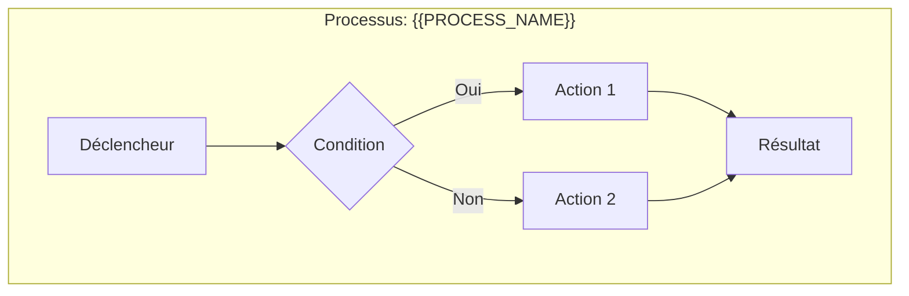
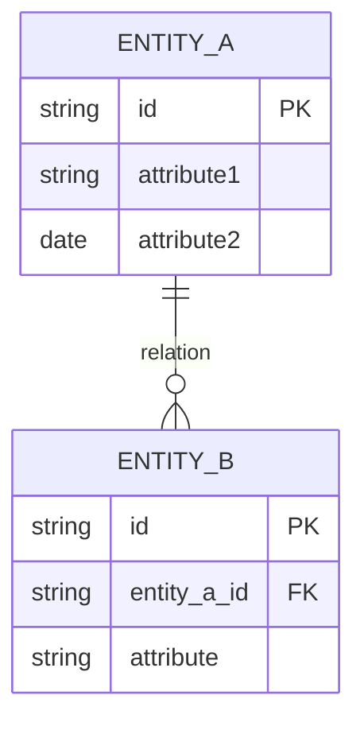

# Business Analyse - Analyse

Expert BA senior en modélisation. Mode ULTRATHINK obligatoire.

## Arguments

```
/business-analyse:analyse [feature-id]
```

- `feature-id` : Identifiant de la feature (ex: FEAT-001)

## Pré-requis

```bash
# Vérifier que la discovery existe
test -f ".business-analyse/applications/*/modules/*/features/$ARGUMENTS/1-discovery.md" || \
  echo "Exécuter /business-analyse:discover d'abord"
```

## Mode ULTRATHINK

**IMPORTANT** : Cette phase utilise le skill `ultrathink` pour une modélisation approfondie.

```
Skill(skill="ultrathink", args="Analyse métier et modélisation BRD")
```

Approche à adopter :
- Modéliser avec précision
- Identifier les patterns métier
- Valider la cohérence
- Anticiper les évolutions

## Workflow

### Étape 1 : Chargement du contexte

```bash
cat .business-analyse/config.json
cat ".business-analyse/applications/*/modules/*/features/$FEATURE_ID/1-discovery.md"
cat .business-analyse/glossary.md
```

### Étape 2 : Modélisation des processus métier

Créer les diagrammes de processus en **Mermaid** :



Pour chaque processus identifier :
- **Déclencheur** : Qu'est-ce qui lance le processus ?
- **Acteurs** : Qui intervient ?
- **Actions** : Quelles étapes ?
- **Décisions** : Quelles conditions/branchements ?
- **Résultats** : Quels outputs ?

### Étape 3 : Modélisation des données

Créer le diagramme ER conceptuel en **Mermaid** :



Pour chaque entité documenter :
- **Attributs clés** : Propriétés essentielles
- **Identifiants** : Clés primaires/naturelles
- **Relations** : Cardinalités et types
- **Contraintes** : Règles de validité

### Étape 4 : Catalogue des règles métier

Documenter TOUTES les règles métier :

| ID | Catégorie | Règle | Condition | Action | Priorité |
|----|-----------|-------|-----------|--------|----------|
| BR-001 | Validation | {{REGLE}} | SI {{COND}} | ALORS {{ACTION}} | HAUTE |
| BR-002 | Calcul | {{REGLE}} | {{FORMULE}} | {{RESULTAT}} | MOYENNE |
| BR-003 | Workflow | {{REGLE}} | {{ETAT}} | {{TRANSITION}} | HAUTE |

Catégories de règles :
- **Validation** : Règles de validation des données
- **Calcul** : Formules et algorithmes métier
- **Workflow** : Transitions d'état et processus
- **Autorisation** : Règles de permissions
- **Contrainte** : Limitations et restrictions

### Étape 5 : Matrice des exigences métier

Créer la matrice de traçabilité :

| ID | Exigence | Type | Priorité | Source | Critère d'acceptation |
|----|----------|------|----------|--------|----------------------|
| REQ-001 | {{EXIGENCE}} | Fonctionnel | Must | Discovery §X | {{CRITERE}} |
| REQ-002 | {{EXIGENCE}} | Non-fonctionnel | Should | Discovery §Y | {{CRITERE}} |

Types d'exigences :
- **Fonctionnel** : Ce que le système doit faire
- **Non-fonctionnel** : Performance, sécurité, UX
- **Contrainte** : Limitations techniques/légales
- **Interface** : Intégrations externes

### Étape 6 : Analyse d'impact

```
╔══════════════════════════════════════════════════════════════════════════╗
║  ANALYSE D'IMPACT                                                        ║
╠══════════════════════════════════════════════════════════════════════════╣
║                                                                          ║
║  SYSTÈMES IMPACTÉS                                                       ║
║  ─────────────────                                                       ║
║  • {{SYSTEME_1}}: {{DESCRIPTION_IMPACT}}                                 ║
║  • {{SYSTEME_2}}: {{DESCRIPTION_IMPACT}}                                 ║
║                                                                          ║
║  DONNÉES IMPACTÉES                                                       ║
║  ─────────────────                                                       ║
║  • {{ENTITE_1}}: {{TYPE_MODIFICATION}} (CREATE/UPDATE/DELETE)            ║
║  • {{ENTITE_2}}: {{TYPE_MODIFICATION}}                                   ║
║                                                                          ║
║  PROCESSUS IMPACTÉS                                                      ║
║  ──────────────────                                                      ║
║  • {{PROCESS_1}}: {{DESCRIPTION_CHANGEMENT}}                             ║
║                                                                          ║
║  UTILISATEURS IMPACTÉS                                                   ║
║  ─────────────────────                                                   ║
║  • {{ROLE_1}}: {{CHANGEMENT_WORKFLOW}}                                   ║
║                                                                          ║
║  RISQUES DE RÉGRESSION                                                   ║
║  ─────────────────────                                                   ║
║  • {{RISQUE_REGRESSION}}                                                 ║
║                                                                          ║
╚══════════════════════════════════════════════════════════════════════════╝
```

### Étape 7 : Mise à jour du glossaire

Ajouter les nouveaux termes métier identifiés dans `.business-analyse/glossary.md`.

### Étape 8 : Génération du BRD

Créer `2-business-requirements.md` :

```markdown
# Business Requirements Document - {{FEATURE_NAME}}

**ID**: {{FEAT-XXX}}
**Version**: 1.0
**Date**: {{DATE}}
**Status**: Draft
**Auteur**: Claude (Business Analyse)

---

## 1. Résumé Exécutif

### 1.1 Objectif
{{OBJECTIF_BUSINESS}}

### 1.2 Bénéfices Attendus
| Bénéfice | Métrique | Cible |
|----------|----------|-------|
| {{BENEFICE}} | {{METRIQUE}} | {{CIBLE}} |

### 1.3 Scope
- **Inclus**: {{IN_SCOPE}}
- **Exclus**: {{OUT_SCOPE}}

---

## 2. Contexte Métier

### 2.1 Situation Actuelle (As-Is)
{{DESCRIPTION_AS_IS}}

```mermaid
flowchart LR
    subgraph "Processus Actuel"
        {{PROCESS_AS_IS}}
    end
```

### 2.2 Situation Cible (To-Be)
{{DESCRIPTION_TO_BE}}

```mermaid
flowchart LR
    subgraph "Processus Cible"
        {{PROCESS_TO_BE}}
    end
```

### 2.3 Gap Analysis
| Aspect | As-Is | To-Be | Gap |
|--------|-------|-------|-----|
| {{ASPECT}} | {{ACTUEL}} | {{CIBLE}} | {{ECART}} |

---

## 3. Parties Prenantes

| Stakeholder | Rôle | Intérêt | Influence | Contact |
|-------------|------|---------|-----------|---------|
| {{NAME}} | {{ROLE}} | {{INTERET}} | HAUTE/MOY/BASSE | {{CONTACT}} |

---

## 4. Exigences Métier

### 4.1 Exigences Fonctionnelles

| ID | Exigence | Priorité | Source | Critère d'acceptation |
|----|----------|----------|--------|----------------------|
| REQ-F-001 | {{EXIGENCE}} | Must | Discovery | {{CRITERE}} |

### 4.2 Exigences Non-Fonctionnelles

| ID | Catégorie | Exigence | Cible |
|----|-----------|----------|-------|
| REQ-NF-001 | Performance | {{EXIGENCE}} | {{CIBLE}} |
| REQ-NF-002 | Sécurité | {{EXIGENCE}} | {{CIBLE}} |
| REQ-NF-003 | Disponibilité | {{EXIGENCE}} | {{CIBLE}} |

### 4.3 Contraintes

| ID | Type | Contrainte | Impact |
|----|------|------------|--------|
| CON-001 | Technique | {{CONTRAINTE}} | {{IMPACT}} |
| CON-002 | Légal | {{CONTRAINTE}} | {{IMPACT}} |

---

## 5. Modèle de Données Conceptuel

### 5.1 Diagramme Entité-Relation

```mermaid
erDiagram
    {{ER_DIAGRAM}}
```

### 5.2 Description des Entités

#### {{ENTITY_NAME}}
| Attribut | Description | Type logique | Obligatoire | Règle |
|----------|-------------|--------------|-------------|-------|
| {{ATTR}} | {{DESC}} | {{TYPE}} | Oui/Non | {{REGLE}} |

---

## 6. Processus Métier

### 6.1 Vue d'ensemble

```mermaid
flowchart TD
    {{PROCESS_OVERVIEW}}
```

### 6.2 Processus détaillés

#### {{PROCESS_NAME}}

**Déclencheur**: {{TRIGGER}}
**Acteurs**: {{ACTORS}}
**Résultat**: {{OUTPUT}}

```mermaid
flowchart TD
    {{PROCESS_DETAIL}}
```

| Étape | Acteur | Action | Données | Règles |
|-------|--------|--------|---------|--------|
| 1 | {{ACTOR}} | {{ACTION}} | {{DATA}} | {{RULES}} |

---

## 7. Règles Métier

### 7.1 Catalogue des règles

| ID | Catégorie | Nom | Description | Condition | Action |
|----|-----------|-----|-------------|-----------|--------|
| BR-001 | {{CAT}} | {{NOM}} | {{DESC}} | SI {{COND}} | ALORS {{ACTION}} |

### 7.2 Matrice règles/entités

| Règle | {{Entity1}} | {{Entity2}} | {{Entity3}} |
|-------|-------------|-------------|-------------|
| BR-001 | ✓ | | ✓ |

---

## 8. Analyse d'Impact

### 8.1 Systèmes
{{IMPACT_SYSTEMES}}

### 8.2 Données
{{IMPACT_DONNEES}}

### 8.3 Processus
{{IMPACT_PROCESSUS}}

### 8.4 Utilisateurs
{{IMPACT_UTILISATEURS}}

---

## 9. Risques

| ID | Risque | Probabilité | Impact | Mitigation | Owner |
|----|--------|-------------|--------|------------|-------|
| RISK-001 | {{RISQUE}} | H/M/L | H/M/L | {{MITIGATION}} | {{OWNER}} |

---

## 10. Hypothèses et Dépendances

### 10.1 Hypothèses
- {{HYPOTHESE_1}}
- {{HYPOTHESE_2}}

### 10.2 Dépendances
| Dépendance | Type | Status | Date prévue |
|------------|------|--------|-------------|
| {{DEP}} | Technique/Métier | En cours/Résolu | {{DATE}} |

---

## 11. Critères de Succès

| Critère | Métrique | Valeur cible | Méthode de mesure |
|---------|----------|--------------|-------------------|
| {{CRITERE}} | {{METRIQUE}} | {{CIBLE}} | {{METHODE}} |

---

## 12. Prochaines Étapes

1. [ ] Validation BRD par {{STAKEHOLDER}}
2. [ ] Exécuter `/business-analyse:specify {{FEAT-XXX}}`

---

## Historique des modifications

| Version | Date | Auteur | Modifications |
|---------|------|--------|---------------|
| 1.0 | {{DATE}} | Claude BA | Création initiale |

---

*Généré par Business Analyse - {{DATE}}*
```

### Résumé

```
ANALYSE MÉTIER COMPLÈTE
═══════════════════════════════════════════════════════════
Feature:     {{FEAT-XXX}} - {{NAME}}
═══════════════════════════════════════════════════════════
Modélisation:
  • Processus:    {{X}} diagrammes
  • Entités:      {{Y}} modélisées
  • Règles:       {{Z}} documentées
  • Exigences:    {{W}} identifiées

Glossaire:    +{{N}} termes ajoutés
═══════════════════════════════════════════════════════════
Document: .../{{FEAT-XXX}}/2-business-requirements.md
═══════════════════════════════════════════════════════════
Prochain: /business-analyse:specify {{FEAT-XXX}}
```

## Règles

1. **ULTRATHINK obligatoire** - Modélisation réfléchie et complète
2. **Diagrammes Mermaid** - Processus et données visualisés
3. **Règles exhaustives** - Toutes les règles métier documentées
4. **Traçabilité** - Chaque exigence a un ID et une source
5. **Glossaire à jour** - Nouveaux termes ajoutés
6. **Aucun code** - Modèle conceptuel, pas technique
