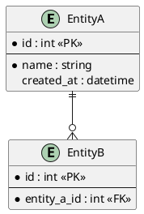
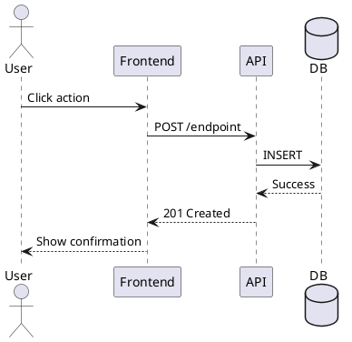

# Business Analysis - PHASE 4: SPECIFY

**You need to always ULTRA THINK.**

**Audience: HUMAN (PO, Tech Lead, Client)**
**Purpose: VALIDATION before development**

---

## Prerequisites

- Phase 3: `.claude/ba/[feature-name]/03-enriched-requirements.md`

---

## Options

| Option | Effect | Token Cost |
|--------|--------|------------|
| `--mockup` | Generate HTML mockup with project CSS | +2,000 |
| `--plantuml` | Generate ER/sequence diagrams | +800 |

---

## Dynamic Sections

Include ONLY relevant sections based on feature type:

| Section | Include When |
|---------|--------------|
| Context | Always |
| Functional Requirements | Always |
| Data Model | DB changes |
| UI Specification | UI changes |
| Navigation | New page/route |
| Permissions | New permissions |
| User Flow | Complex workflow |
| API Specification | Backend changes |
| Acceptance Criteria | Always |

---

## FRD Template

```markdown
# Functional Requirements Document: [Feature Name]

| Field | Value |
|-------|-------|
| Version | 1.0 |
| Status | Draft - Pending Validation |
| Author | Claude (BA Phase 4) |
| Date | [Date] |
| Source | [feature-name]/03-enriched-requirements.md |

---

## 1. Context

### Problem Statement
[From enriched requirements]

### Current State
[How it works today - be specific]

### Target State
[How it will work after implementation]

### Success Metrics
- [Metric 1: measurable outcome]
- [Metric 2: measurable outcome]

---

## 2. Functional Requirements

### Core Requirements

| ID | Requirement | Priority | Source |
|----|-------------|----------|--------|
| FR-01 | [Detailed functional requirement] | Must | BR-01 |
| FR-02 | [Detailed functional requirement] | Must | BR-02 |
| FR-03 | [Detailed functional requirement] | Should | BR-03 |

### Business Rules

| ID | Rule | Enforcement |
|----|------|-------------|
| BRU-01 | [If condition then action] | [Backend/Frontend/Both] |
| BRU-02 | [Constraint or validation] | [Where enforced] |

---

## 3. Data Model (if DB changes)

### Entities

| Entity | Action | Description |
|--------|--------|-------------|
| [Entity] | CREATE/MODIFY | [What changes] |

### Attributes

| Entity | Attribute | Type | Required | Constraints |
|--------|-----------|------|----------|-------------|
| [Entity] | [Attr] | string(100) | Yes | Unique |
| [Entity] | [Attr] | int | No | Min: 0 |

### Relationships

| From | To | Type | Description |
|------|-----|------|-------------|
| [Entity A] | [Entity B] | 1:N | [Description] |

### PlantUML (if --plantuml)



---

## 4. UI Specification (if UI changes)

### Screen: [Screen Name]

**Location**: [Route/Path]
**Access**: [Permission required]

#### Layout

| Zone | Component | Behavior |
|------|-----------|----------|
| Header | Title + Actions | [Buttons: New, Export] |
| Content | Data Table | [Sortable, paginated] |
| Footer | Pagination | [10/25/50 per page] |

#### Components

| Component | Type | Configuration |
|-----------|------|---------------|
| List | p-table | sortable, filterable, paginated |
| Form | p-dialog | modal, width: 600px |
| Actions | p-button | severity: primary/secondary |

#### Interactions

| Action | Trigger | Result |
|--------|---------|--------|
| Create | Click "New" button | Open form dialog |
| Edit | Click row | Open form with data |
| Delete | Click delete icon | Confirmation dialog |

### HTML Mockup (if --mockup)

```html
<!-- Uses project design system -->
<div class="card">
  <div class="card-header">
    <h2>[Title]</h2>
    <div class="actions">
      <button class="p-button p-button-primary">New</button>
    </div>
  </div>
  <div class="card-body">
    <p-table [value]="items" [paginator]="true" [rows]="10">
      <!-- columns -->
    </p-table>
  </div>
</div>
```

---

## 5. Navigation (if new page)

| Field | Value |
|-------|-------|
| Route | /module/feature |
| Menu Parent | [Parent Menu Name] |
| Menu Label | [Display Label] |
| Menu Icon | pi pi-[icon] |
| Menu Order | [number] |
| Guards | [PermissionGuard] |

---

## 6. Permissions (if new permissions)

### New Permissions

| Key | Display Name | Description |
|-----|--------------|-------------|
| module.view | View [Feature] | Access to view list |
| module.create | Create [Feature] | Create new items |
| module.edit | Edit [Feature] | Modify existing items |
| module.delete | Delete [Feature] | Remove items |

### Role Assignment

| Role | Permissions |
|------|-------------|
| Admin | view, create, edit, delete |
| Manager | view, create, edit |
| User | view |

---

## 7. User Flow (if complex workflow)

### Main Flow

| Step | Actor | Action | System Response | Next |
|------|-------|--------|-----------------|------|
| 1 | User | [Action] | [Response] | 2 |
| 2 | User | [Action] | [Response] | 3 |
| 3 | System | [Auto action] | [Result] | End |

### Alternative Flows

| From Step | Condition | Action | Goes To |
|-----------|-----------|--------|---------|
| 2 | Validation fails | Show error | 2 |
| 3 | [Condition] | [Action] | [Step] |

### PlantUML Sequence (if --plantuml)



---

## 8. API Specification (if backend changes)

### Endpoints

| Method | Endpoint | Description | Permission |
|--------|----------|-------------|------------|
| GET | /api/[resource] | List all | resource.view |
| GET | /api/[resource]/{id} | Get by ID | resource.view |
| POST | /api/[resource] | Create | resource.create |
| PUT | /api/[resource]/{id} | Update | resource.edit |
| DELETE | /api/[resource]/{id} | Delete | resource.delete |

### Request/Response

#### POST /api/[resource]

**Request:**
```json
{
  "name": "string",
  "description": "string | null"
}
```

**Response (201):**
```json
{
  "id": 1,
  "name": "string",
  "description": "string | null",
  "createdAt": "2024-01-01T00:00:00Z"
}
```

**Errors:**
| Code | Condition |
|------|-----------|
| 400 | Validation failed |
| 401 | Not authenticated |
| 403 | Missing permission |
| 409 | Duplicate name |

---

## 9. Acceptance Criteria

| ID | Criterion | Type | Testable |
|----|-----------|------|----------|
| AC-01 | [Given-When-Then format] | Functional | Yes |
| AC-02 | [Given-When-Then format] | Functional | Yes |
| AC-03 | [Performance/Security criterion] | Non-functional | Yes |

### Detailed Acceptance Tests

**AC-01: [Title]**
- **Given**: [Precondition]
- **When**: [Action]
- **Then**: [Expected result]

---

## 10. Validation Checklist

### Functional Review (PO/Client)
- [ ] Requirements cover all use cases
- [ ] Business rules are correct
- [ ] UI matches expectations
- [ ] Acceptance criteria are clear

### Technical Review (Tech Lead)
- [ ] Data model is consistent
- [ ] API design follows standards
- [ ] Permissions are appropriate
- [ ] Patterns align with codebase

### Sign-off

| Role | Name | Date | Status |
|------|------|------|--------|
| PO | _________ | _____ | Pending |
| Tech Lead | _________ | _____ | Pending |
```

---

## Output Rules

1. **Complete** - All relevant sections filled
2. **Precise** - No ambiguous requirements
3. **Traceable** - Link to source requirements (BR-XX)
4. **Testable** - Every criterion is verifiable
5. **Human-readable** - No technical jargon in user-facing sections

## File Output

Save to: `.claude/ba/[feature-name]/04-functional-spec.md`

---

## Next Phase

Present to user for validation:

```
/business-analyse:5-validate
```

Phase 5 will guide the validation process with the user.

---

User: $ARGUMENTS
