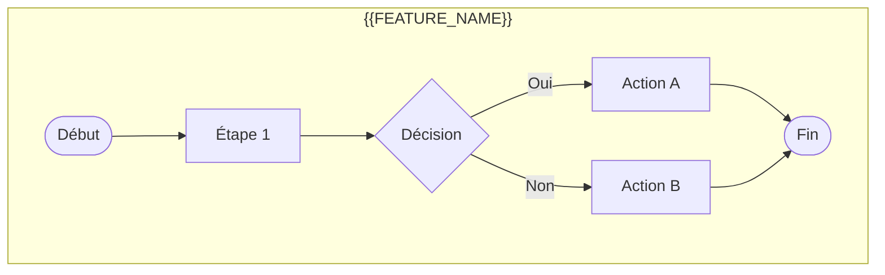
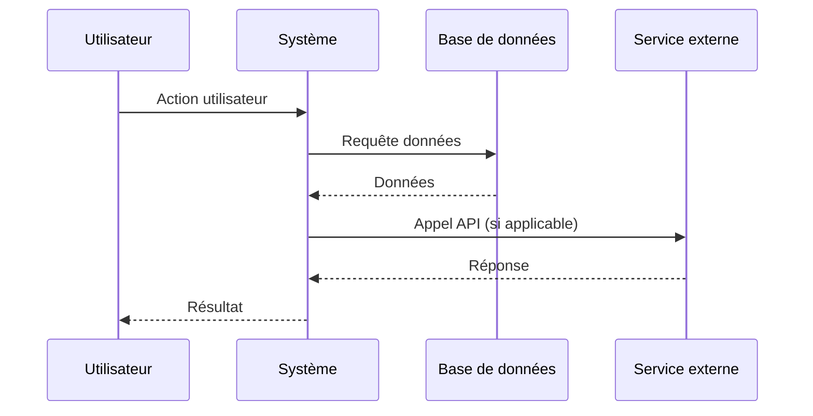
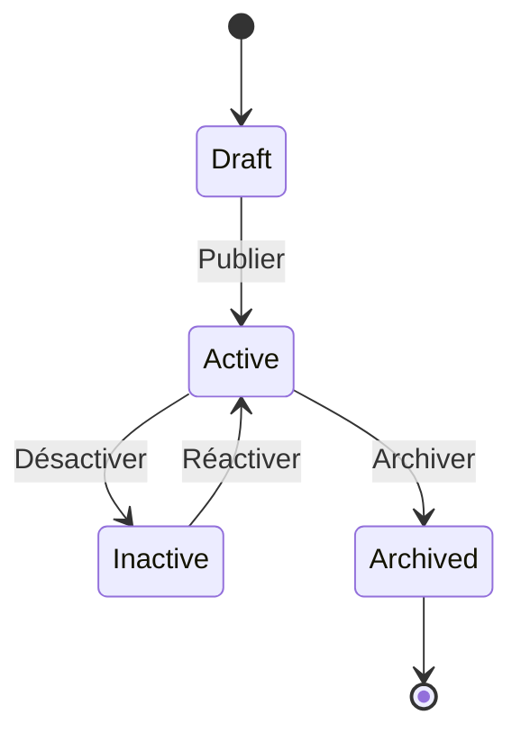

# Business Analyse - Document

Expert BA senior en documentation. Mise à jour des référentiels.

## Arguments

```
/business-analyse:document [feature-id]
```

- `feature-id` : Identifiant de la feature (ex: FEAT-001)

## Pré-requis

```bash
# Vérifier que le FRD existe
test -f ".business-analyse/applications/*/modules/*/features/$ARGUMENTS/3-functional-specification.md" || \
  echo "Exécuter /business-analyse:specify d'abord"
```

## Workflow

### Étape 1 : Chargement du contexte

```bash
cat ".business-analyse/applications/*/modules/*/features/$FEATURE_ID/3-functional-specification.md"
cat .business-analyse/glossary.md
```

### Étape 2 : Mise à jour du glossaire

Analyser les documents et identifier les termes métier à ajouter.

Mettre à jour `.business-analyse/glossary.md` :

```markdown
## Termes Métier

| Terme | Définition | Contexte | Ajouté le |
|-------|------------|----------|-----------|
| {{TERME}} | {{DEFINITION}} | {{FEATURE_ID}} | {{DATE}} |
```

**Règles pour le glossaire** :
- Définitions claires et non ambiguës
- Un seul terme par ligne
- Contexte d'origine tracé
- Pas de jargon technique (sauf si nécessaire)

### Étape 3 : Dictionnaire de données

Créer/Mettre à jour `.business-analyse/documentation/data-dictionary/{{FEATURE_ID}}.md` :

```markdown
# Dictionnaire de Données - {{FEATURE_NAME}}

**Feature**: {{FEAT-XXX}}
**Date**: {{DATE}}
**Source**: FRD v1.0

---

## Entités

### {{ENTITY_NAME}}

| Attribut | Type logique | Description | Contraintes | Exemple |
|----------|--------------|-------------|-------------|---------|
| id | Identifiant unique | Clé primaire | Auto-généré, UUID | 550e8400-e29b-... |
| name | Texte court | Nom de l'entité | 2-100 chars, requis | "Mon item" |
| status | Énumération | État actuel | [actif, inactif, archivé] | actif |
| created_at | Date/Heure | Date de création | Auto, non modifiable | 2024-01-15T10:30:00Z |
| updated_at | Date/Heure | Dernière modification | Auto | 2024-01-16T14:20:00Z |

#### Relations

| Relation | Entité liée | Cardinalité | Description |
|----------|-------------|-------------|-------------|
| {{RELATION}} | {{ENTITY}} | 1:N / N:M | {{DESCRIPTION}} |

#### Règles métier applicables

- BR-001: {{REGLE}}
- BR-002: {{REGLE}}

---

### {{ENTITY_NAME_2}}

...

---

## Énumérations

### {{ENUM_NAME}}

| Valeur | Label | Description |
|--------|-------|-------------|
| active | Actif | L'élément est visible et utilisable |
| inactive | Inactif | L'élément est masqué |
| archived | Archivé | L'élément est en lecture seule |

---

*Généré par Business Analyse - {{DATE}}*
```

### Étape 4 : Flux de processus

Créer `.business-analyse/documentation/process-flows/{{FEATURE_ID}}.md` :

```markdown
# Flux de Processus - {{FEATURE_NAME}}

**Feature**: {{FEAT-XXX}}
**Date**: {{DATE}}

---

## Vue d'ensemble



---

## Processus détaillés

### {{PROCESS_NAME}}

**Déclencheur**: {{TRIGGER}}
**Fréquence**: {{FREQUENCY}}
**Durée moyenne**: {{DURATION}}



#### Étapes détaillées

| # | Acteur | Action | Système | Données | Durée |
|---|--------|--------|---------|---------|-------|
| 1 | {{ACTOR}} | {{ACTION}} | {{SYSTEM}} | {{DATA}} | {{TIME}} |

#### Points d'attention

- {{POINT_ATTENTION_1}}
- {{POINT_ATTENTION_2}}

---

## Diagramme d'états



---

*Généré par Business Analyse - {{DATE}}*
```

### Étape 5 : Architecture Decision Records (si applicable)

Si des décisions architecturales ont été prises, créer `.business-analyse/documentation/architecture-decisions/ADR-{{NNN}}.md` :

```markdown
# ADR-{{NNN}}: {{TITRE}}

**Date**: {{DATE}}
**Status**: Proposé | Accepté | Déprécié | Remplacé par ADR-XXX
**Feature**: {{FEAT-XXX}}

---

## Contexte

{{CONTEXTE_PROBLEME}}

## Décision

{{DECISION_PRISE}}

## Conséquences

### Positives
- {{CONSEQUENCE_POSITIVE_1}}
- {{CONSEQUENCE_POSITIVE_2}}

### Négatives
- {{CONSEQUENCE_NEGATIVE_1}}

### Risques
- {{RISQUE}}

## Alternatives considérées

### Option 1: {{NOM}}
{{DESCRIPTION}}
- ✓ Avantage
- ✗ Inconvénient

### Option 2: {{NOM}}
{{DESCRIPTION}}
- ✓ Avantage
- ✗ Inconvénient

## Références

- [BRD](../applications/.../2-business-requirements.md)
- [FRD](../applications/.../3-functional-specification.md)

---

*Décision prise le {{DATE}}*
```

### Étape 6 : Traçabilité des exigences

Créer/Mettre à jour `.business-analyse/documentation/traceability-matrix.md` :

```markdown
# Matrice de Traçabilité des Exigences

**Dernière mise à jour**: {{DATE}}

---

## {{FEAT-XXX}} - {{FEATURE_NAME}}

| ID Exigence | Source | Use Case | Écran | API | Test | Status |
|-------------|--------|----------|-------|-----|------|--------|
| REQ-F-001 | BRD §4.1 | UC-001 | LIST-001 | GET /api/x | TC-001 | Draft |
| REQ-F-002 | BRD §4.1 | UC-002 | FORM-001 | POST /api/x | TC-002 | Draft |

---

## Légende

| Status | Description |
|--------|-------------|
| Draft | En cours de spécification |
| Ready | Prêt pour développement |
| InDev | En développement |
| Done | Implémenté et testé |

---

*Généré par Business Analyse*
```

### Étape 7 : Index de la feature

Créer `.business-analyse/applications/{{APP}}/modules/{{MODULE}}/features/{{FEAT-XXX}}/README.md` :

```markdown
# {{FEAT-XXX}} - {{FEATURE_NAME}}

## Résumé

{{RESUME}}

## Documents

| Phase | Document | Status | Lien |
|-------|----------|--------|------|
| Discovery | Élicitation | ✓ | [1-discovery.md](./1-discovery.md) |
| Analyse | BRD | ✓ | [2-business-requirements.md](./2-business-requirements.md) |
| Spécification | FRD | ✓ | [3-functional-specification.md](./3-functional-specification.md) |
| Handoff | Prompt Dev | ⏳ | [4-development-handoff.md](./4-development-handoff.md) |

## Métriques

| Métrique | Valeur |
|----------|--------|
| Exigences | {{X}} |
| Use Cases | {{Y}} |
| Écrans | {{Z}} |
| Endpoints | {{W}} |
| Score complétude | {{PERCENT}}% |

## Historique

| Date | Action | Auteur |
|------|--------|--------|
| {{DATE}} | Documentation créée | Claude BA |

---

*Feature créée le {{DATE}}*
```

### Résumé

```
DOCUMENTATION COMPLÈTE
═══════════════════════════════════════════════════════════
Feature:     {{FEAT-XXX}} - {{NAME}}
═══════════════════════════════════════════════════════════
Documents créés/mis à jour:
  ✓ Glossaire:           +{{X}} termes
  ✓ Dictionnaire données: {{Y}} entités
  ✓ Flux processus:      {{Z}} diagrammes
  ✓ Traçabilité:         Mise à jour
  ✓ Index feature:       Créé

ADRs: {{N}} (si applicable)
═══════════════════════════════════════════════════════════
Prochain: /business-analyse:handoff {{FEAT-XXX}}
```

## Règles

1. **Glossaire cohérent** - Un terme = une définition
2. **Dictionnaire complet** - Toutes les entités documentées
3. **Diagrammes Mermaid** - Flux visualisés
4. **Traçabilité** - Exigence → Test
5. **ADR si décision** - Documenter les choix importants
6. **Aucun code** - Documentation métier uniquement
