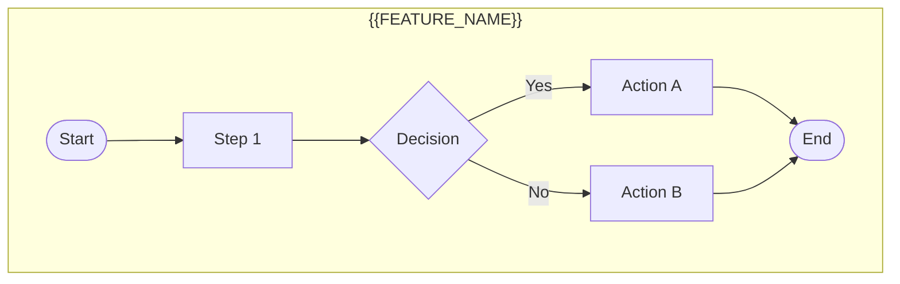
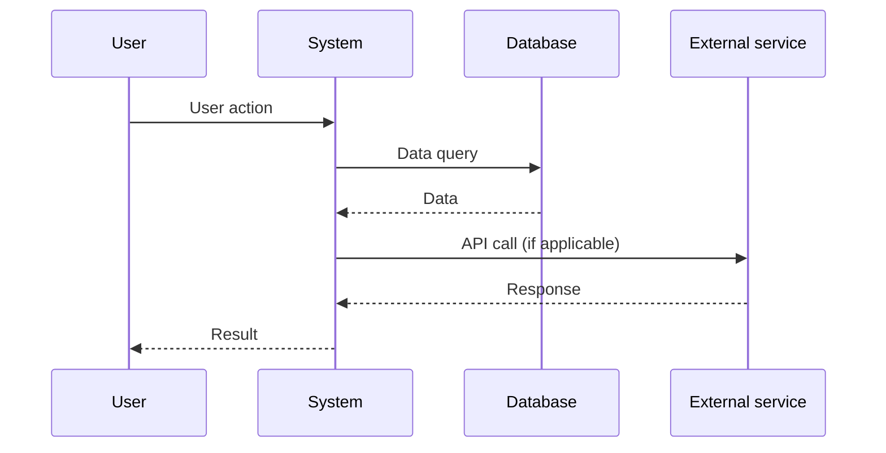
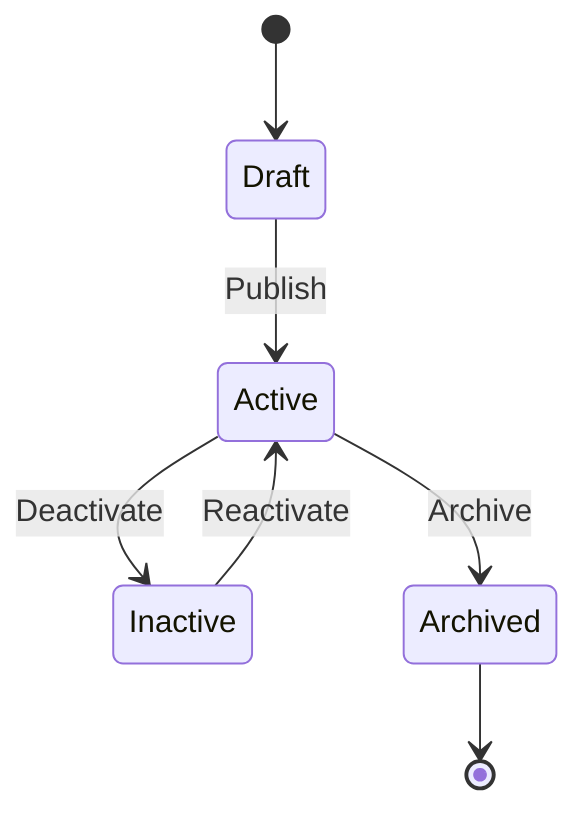

# Business Analyse - Document

Senior BA expert in documentation. Generate user-friendly documentation.

> **Note**: This phase comes AFTER handoff. It generates documentation that
> the business user can read and understand, not technical specifications.

## ULTRATHINK Mode

**IMPORTANT**: This phase uses deep thinking for comprehensive documentation.

Approach to adopt:
- Ensure consistency across all documents
- Identify missing cross-references
- Validate terminology alignment with glossary
- Trace requirements to implementation
- Anticipate documentation gaps

## Arguments

```
/business-analyse:document [feature-id]
```

- `feature-id`: Feature identifier (e.g., FEAT-001)

## Prerequisites

```bash
# Verify that FRD exists
test -f ".business-analyse/applications/*/modules/*/features/$ARGUMENTS/3-functional-specification.md" || \
  echo "Execute /business-analyse:specify first"
```

## Workflow

### Step 1: Loading context

```bash
cat ".business-analyse/applications/*/modules/*/features/$FEATURE_ID/3-functional-specification.md"
cat .business-analyse/glossary.md
```

### Step 2: Glossary update

Analyze documents and identify business terms to add.

Update `.business-analyse/glossary.md`:

```markdown
## Business Terms

| Term | Definition | Context | Added on |
|------|------------|---------|----------|
| {{TERM}} | {{DEFINITION}} | {{FEATURE_ID}} | {{DATE}} |
```

**Glossary rules**:
- Clear and unambiguous definitions
- One term per line
- Origin context traced
- No technical jargon (unless necessary)

### Step 3: Data dictionary

Create/Update `.business-analyse/documentation/data-dictionary/{{FEATURE_ID}}.md`:

```markdown
# Data Dictionary - {{FEATURE_NAME}}

**Feature**: {{FEAT-XXX}}
**Date**: {{DATE}}
**Source**: FRD v1.0

---

## Entities

### {{ENTITY_NAME}}

| Attribute | Logical type | Description | Constraints | Example |
|-----------|--------------|-------------|-------------|---------|
| id | Unique identifier | Primary key | Auto-generated, UUID | 550e8400-e29b-... |
| name | Short text | Entity name | 2-100 chars, required | "My item" |
| status | Enumeration | Current state | [active, inactive, archived] | active |
| created_at | Date/Time | Creation date | Auto, immutable | 2024-01-15T10:30:00Z |
| updated_at | Date/Time | Last modification | Auto | 2024-01-16T14:20:00Z |

#### Relations

| Relation | Related entity | Cardinality | Description |
|----------|----------------|-------------|-------------|
| {{RELATION}} | {{ENTITY}} | 1:N / N:M | {{DESCRIPTION}} |

#### Applicable business rules

- BR-001: {{RULE}}
- BR-002: {{RULE}}

---

### {{ENTITY_NAME_2}}

...

---

## Enumerations

### {{ENUM_NAME}}

| Value | Label | Description |
|-------|-------|-------------|
| active | Active | Element is visible and usable |
| inactive | Inactive | Element is hidden |
| archived | Archived | Element is read-only |

---

*Generated by Business Analyse - {{DATE}}*
```

### Step 4: Process flows

Create `.business-analyse/documentation/process-flows/{{FEATURE_ID}}.md`:

```markdown
# Process Flows - {{FEATURE_NAME}}

**Feature**: {{FEAT-XXX}}
**Date**: {{DATE}}

---

## Overview



---

## Detailed processes

### {{PROCESS_NAME}}

**Trigger**: {{TRIGGER}}
**Frequency**: {{FREQUENCY}}
**Average duration**: {{DURATION}}



#### Detailed steps

| # | Actor | Action | System | Data | Duration |
|---|-------|--------|--------|------|----------|
| 1 | {{ACTOR}} | {{ACTION}} | {{SYSTEM}} | {{DATA}} | {{TIME}} |

#### Points of attention

- {{ATTENTION_POINT_1}}
- {{ATTENTION_POINT_2}}

---

## State diagram



---

*Generated by Business Analyse - {{DATE}}*
```

### Step 5: Architecture Decision Records (if applicable)

If architectural decisions were made, create `.business-analyse/documentation/architecture-decisions/ADR-{{NNN}}.md`:

```markdown
# ADR-{{NNN}}: {{TITLE}}

**Date**: {{DATE}}
**Status**: Proposed | Accepted | Deprecated | Replaced by ADR-XXX
**Feature**: {{FEAT-XXX}}

---

## Context

{{PROBLEM_CONTEXT}}

## Decision

{{DECISION_MADE}}

## Consequences

### Positive
- {{POSITIVE_CONSEQUENCE_1}}
- {{POSITIVE_CONSEQUENCE_2}}

### Negative
- {{NEGATIVE_CONSEQUENCE_1}}

### Risks
- {{RISK}}

## Alternatives considered

### Option 1: {{NAME}}
{{DESCRIPTION}}
- ✓ Advantage
- ✗ Disadvantage

### Option 2: {{NAME}}
{{DESCRIPTION}}
- ✓ Advantage
- ✗ Disadvantage

## References

- [BRD](../applications/.../2-business-requirements.md)
- [FRD](../applications/.../3-functional-specification.md)

---

*Decision made on {{DATE}}*
```

### Step 6: Requirements traceability

Create/Update `.business-analyse/documentation/traceability-matrix.md`:

```markdown
# Requirements Traceability Matrix

**Last update**: {{DATE}}

---

## {{FEAT-XXX}} - {{FEATURE_NAME}}

| Requirement ID | Source | Use Case | Screen | API | Test | Status |
|----------------|--------|----------|--------|-----|------|--------|
| REQ-F-001 | BRD §4.1 | UC-001 | LIST-001 | GET /api/x | TC-001 | Draft |
| REQ-F-002 | BRD §4.1 | UC-002 | FORM-001 | POST /api/x | TC-002 | Draft |

---

## Legend

| Status | Description |
|--------|-------------|
| Draft | Under specification |
| Ready | Ready for development |
| InDev | In development |
| Done | Implemented and tested |

---

*Generated by Business Analyse*
```

### Step 7: Feature index

Create `.business-analyse/applications/{{APP}}/modules/{{MODULE}}/features/{{FEAT-XXX}}/README.md`:

```markdown
# {{FEAT-XXX}} - {{FEATURE_NAME}}

## Summary

{{SUMMARY}}

## Documents

| Phase | Document | Status | Link |
|-------|----------|--------|------|
| Discovery | Elicitation | ✓ | [1-discovery.md](./1-discovery.md) |
| Analysis | BRD | ✓ | [2-business-requirements.md](./2-business-requirements.md) |
| Specification | FRD | ✓ | [3-functional-specification.md](./3-functional-specification.md) |
| Handoff | Dev Prompt | ⏳ | [4-development-handoff.md](./4-development-handoff.md) |

## Metrics

| Metric | Value |
|--------|-------|
| Requirements | {{X}} |
| Use Cases | {{Y}} |
| Screens | {{Z}} |
| Endpoints | {{W}} |
| Completeness score | {{PERCENT}}% |

## History

| Date | Action | Author |
|------|--------|--------|
| {{DATE}} | Documentation created | Claude BA |

---

*Feature created on {{DATE}}*
```

### Summary

```
DOCUMENTATION COMPLETE
═══════════════════════════════════════════════════════════
Feature:     {{FEAT-XXX}} - {{NAME}}
═══════════════════════════════════════════════════════════
Documents created/updated:
  ✓ Glossary:           +{{X}} terms
  ✓ Data dictionary:    {{Y}} entities
  ✓ Process flows:      {{Z}} diagrams
  ✓ Traceability:       Updated
  ✓ Feature index:      Created

ADRs: {{N}} (if applicable)
═══════════════════════════════════════════════════════════
Next: /business-analyse:handoff {{FEAT-XXX}}
```

## Rules

1. **Consistent glossary** - One term = one definition
2. **Complete dictionary** - All entities documented
3. **Mermaid diagrams** - Visualized flows
4. **Traceability** - Requirement → Test
5. **ADR if decision** - Document important choices
6. **No code** - Business documentation only
