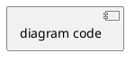

# Business Analysis - PHASE 2: SPECIFICATION

**You need to always ULTRA THINK.**

**Audience: HUMAN (PO, Tech Lead, Client)**
**Purpose: VALIDATION before development**

## Options

| Option | Effect | Token Cost |
|--------|--------|------------|
| `--mockup` | Generate HTML mockup with project CSS | +2,000 |
| `--plantuml` | Generate ER diagram | +800 |

## Dynamic Sections

Include ONLY relevant sections:

| Section | Include When |
|---------|--------------|
| Context | Always |
| Requirements | Always |
| Data Model | DB changes |
| UI Specification | UI changes |
| Navigation | New page/route |
| Permissions | New permissions |
| User Flow | Complex workflow |
| Acceptance | Always |

## Document Template

```markdown
# Specification: [Feature Name]

| Field | Value |
|-------|-------|
| Version | 1.0 |
| Status | Draft - Pending Validation |
| Track | QUICK / FULL |

---

## 1. Context

**Problem**: [What problem does this solve?]

**Current State**: [How it works today]

**Target State**: [How it should work]

---

## 2. Requirements

### Functional

| ID | Requirement | Priority |
|----|-------------|----------|
| FR-01 | [requirement] | High |
| FR-02 | [requirement] | Medium |

### Technical

| ID | Requirement | Reference |
|----|-------------|-----------|
| TR-01 | [requirement] | [file:line] |

---

## 3. Data Model (if DB changes)

### Tables Affected

| Table | Action | Changes |
|-------|--------|---------|
| [Table] | CREATE/MODIFY | [description] |

### Columns

| Table | Column | Type | Nullable | Notes |
|-------|--------|------|----------|-------|
| [Table] | [Col] | [Type] | Y/N | [notes] |

### PlantUML (if --plantuml)



---

## 4. UI Specification (if UI changes)

### Layout Reference

**Base on**: [existing page path]
**Components**: [p-table, p-dialog, etc.]

### Elements

| Element | Component | Props/Config |
|---------|-----------|--------------|
| List | p-table | sortable, paginated |
| Form | p-dialog | modal, 600px width |

### HTML Mockup (if --mockup)

```html
<!-- Generated with project design system -->
<div class="card">
  [mockup code]
</div>
```

---

## 5. Navigation (if new page)

| Field | Value |
|-------|-------|
| Route | /path/to/page |
| Menu Parent | [Parent Menu] |
| Menu Label | [Label] |
| Menu Icon | pi pi-[icon] |
| Menu Order | [number] |

---

## 6. Permissions (if new permissions)

### New Permissions

| Key | Name | Description |
|-----|------|-------------|
| [module].[action] | [Display Name] | [description] |

### Role Matrix

| Role | Permissions |
|------|-------------|
| Admin | all |
| Manager | view, create, edit |
| User | view |

---

## 7. User Flow (if complex workflow)

| Step | Action | Next | Alternative |
|------|--------|------|-------------|
| 1 | [action] | Step 2 | - |
| 2 | [action] | Step 3 | Alt Step |
| 3 | [action] | End | - |
| Alt | [action] | Step 3 | - |

---

## 8. Acceptance Criteria

| ID | Criterion | Testable |
|----|-----------|----------|
| AC-01 | [criterion] | ✓ |
| AC-02 | [criterion] | ✓ |

---

## Validation Checklist

**Functional** (PO/Client)
- [ ] Requirements cover all use cases
- [ ] Acceptance criteria are clear

**Technical** (Tech Lead)
- [ ] Data model is consistent
- [ ] Patterns align with codebase

**UI/UX** (if applicable)
- [ ] Layout matches expectations
- [ ] Navigation placement is correct

**Validated by**: _____________ **Date**: _____________
```

## Compact Format (QUICK Track)

For simple features, use this condensed format:

```markdown
# Quick Spec: [Feature Name]

## Context
[2-3 sentences max]

## Requirements
1. [requirement 1]
2. [requirement 2]
3. [requirement 3]

## UI Reference
Same as [existing page], add [element] at [location]

## Permissions
Requires: `[permission.key]` (new/existing)

## Acceptance
- [ ] [criterion 1]
- [ ] [criterion 2]

---
Validation: [ ] Approved  [ ] Changes requested
```

## Next Phase

After human validation:
```
/business-analyse:3-handoff
```

---

User: $ARGUMENTS
